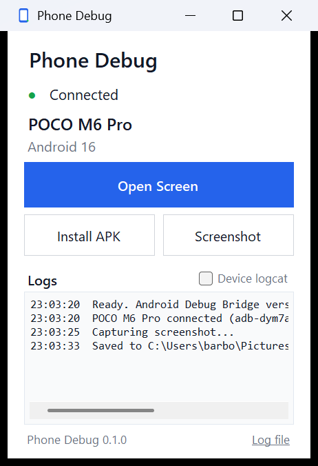

# Phone Debug

Plug in an Android phone and see it on your PC. `phone-debug` waits for a
device, tells you what it found and opens the screen - no flags, no setup.

Same engine, two front ends: a command line and a small Windows app.



## Requirements

- Windows 10 or 11 (x64)
- [adb](https://developer.android.com/tools/releases/platform-tools) and
  [scrcpy](https://github.com/Genymobile/scrcpy) - the installer sets both up for you
- A phone with **USB debugging** enabled
  (Settings > About phone > tap *Build number* 7 times, then
  Settings > System > Developer options > USB debugging)

Releases carry their own .NET runtime, so nothing else is needed.

## Install

Download the release zip, unpack it, and run:

```powershell
powershell -ExecutionPolicy Bypass -File install.ps1
```

That copies Phone Debug to `%LOCALAPPDATA%\PhoneDebug\bin`, puts it on your
PATH, adds a Start Menu entry and installs adb and scrcpy through winget if
they are missing. No administrator rights, nothing changed system-wide.

To remove it:

```powershell
powershell -ExecutionPolicy Bypass -File uninstall.ps1
```

## First run

Open a **new** terminal:

```powershell
phone-debug
```

```text
Phone Debug 0.1.0

✓ ADB found
✓ scrcpy found

Waiting for Android device...

✓ Samsung Galaxy S24 connected
  Android 15

Starting mirror...
```

Unplug the phone and it goes back to waiting. Plug it in again and the screen
reopens. If the phone has not been trusted yet, you are told to unlock it and
accept **Allow USB debugging**.

## No phone connected?

```powershell
phone-debug connect
```

It walks you through it: the USB steps, or wireless debugging over Wi-Fi. For
Wi-Fi it prints a QR code in the terminal that you scan with the phone
(Developer options > Wireless debugging > *Pair device with QR code*) and pairs
by itself. The Windows app has the same thing behind **Connect a phone**.

```powershell
phone-debug connect qr                       # straight to the QR code
phone-debug connect usb                      # USB steps, then wait
phone-debug pair 192.168.0.10:37123 123456   # code shown by the phone
phone-debug connect 192.168.0.10:5555        # already paired, just connect
```

Both devices have to be on the same Wi-Fi network.

## Command line

```text
phone-debug                    Wait for a device and open the screen
phone-debug connect            Connect a phone (USB steps, or Wi-Fi QR code)
phone-debug mirror             Mirror and control the device
phone-debug devices            List connected devices
phone-debug info               Show device information
phone-debug install app.apk    Install an APK
phone-debug logs               Stream the Android log
phone-debug screenshot [path]  Capture the screen
phone-debug reboot             Reboot the device
phone-debug --help
phone-debug --version
```

Examples:

```powershell
phone-debug install "C:\my builds\demo.apk"
phone-debug screenshot "D:\captures\before.png"
phone-debug logs | Select-String "MyApp"
```

Screenshots default to `Pictures\Phone Debug`.

## Windows app

Start **Phone Debug** from the Start Menu, or run `PhoneDebug.exe`.

It shows whether a phone is connected, which one, and gives you *Open Screen*,
*Install APK* and *Screenshot*, with a log panel underneath. It follows the
phone by itself - connect or disconnect and the window updates. With no phone
attached, the button becomes **Connect a phone** and opens the same QR pairing
screen as the command line.

## Troubleshooting

| What you see | What to do |
| --- | --- |
| `ADB not found` / `scrcpy not found` | Rerun `install.ps1`, or `winget install Google.PlatformTools Genymobile.scrcpy`, then open a new terminal |
| `Android device detected` but nothing happens | Unlock the phone and accept **Allow USB debugging** |
| `The device is offline` | Unplug and reconnect, or toggle USB debugging off and on |
| `phone-debug` is not recognised | Open a *new* terminal - PATH changes do not reach open ones |
| **The screen shows but the mouse does nothing** | Some phones (Xiaomi, POCO, Redmi) block injected input. Phone Debug notices and reopens the mirror as an emulated USB keyboard and mouse, which they do accept. If it still will not respond, turn on **USB debugging (Security settings)** in Developer options (needs a Mi account and a SIM card) and reboot the phone |
| **The mouse is stuck inside the mirror window** | That is emulated input mode - press **left Alt** (or the left Windows key) to give the cursor back. `phone-debug --standard` goes back to normal input |
| **The picture stutters** | Over Wi-Fi the whole screen travels across the network. Use a USB cable, or `phone-debug --light` for a smaller, smoother stream |
| Mirroring opens then closes | Reconnect the phone; if it keeps happening, check the log file |
| Nothing connects at all | `phone-debug connect` - it walks through USB and Wi-Fi setup |
| Anything else | `%LOCALAPPDATA%\PhoneDebug\logs\phone-debug.log` has the technical detail |

Portable setup: drop `adb.exe` and `scrcpy.exe` into the `tools` folder next to
the executables and they are used instead of the installed ones - see
[tools/README.md](tools/README.md).

## Build from source

```powershell
dotnet test
.\build-release.ps1
```

The package lands in `dist\PhoneDebug-v<version>-win-x64\`.

```text
PhoneDebug.Core/   ADB, scrcpy, device detection - all the logic
PhoneDebug.Cli/    phone-debug.exe
PhoneDebug.App/    PhoneDebug.exe (WinForms)
PhoneDebug.Tests/  xunit tests for the core
```

The version lives in one place, `Directory.Build.props`.

## Licence

MIT - see [LICENSE](LICENSE). adb and scrcpy are separate projects with their
own licences; see [THIRD-PARTY-NOTICES.md](THIRD-PARTY-NOTICES.md).
